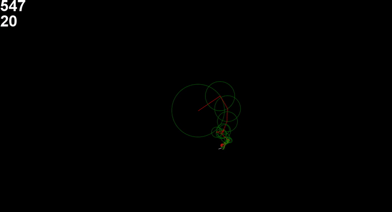

# Discrete Fourier transform visualization

"Discrete Fourier transform visualization" is Java project that is based on Fourier series formula. This program converts the coordinates of the points that create a path
to an epicycle that recreates the path using circles.

# Features
Control of:
  - maximum number of cicles on screen (using ↑ and ↓ buttons)
  - drawing speed
  - choosing path from builed in paths
  - choosing path from a txt file
  - creating path using mouse
  

# Examples
***Example 1***

***Example 2***

